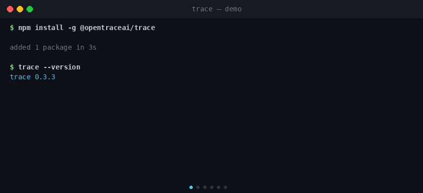
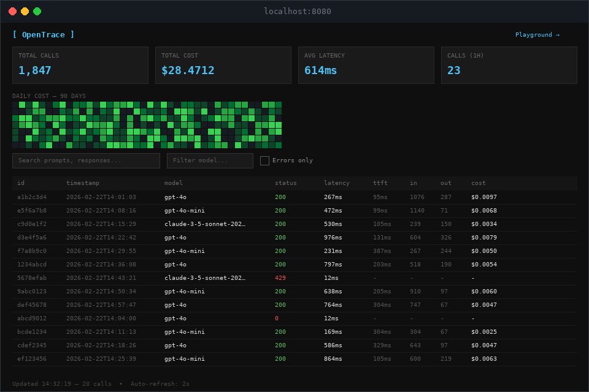

# OpenTrace

> **The `strace` of LLM calls.** A single Rust binary that acts as a local reverse proxy, recording every LLM request and response to a SQLite file on your machine. No cloud. No infra. No data leaving your machine.
>
> [](LICENSE)
> [](https://www.npmjs.com/package/@opentraceai/trace)
>
> ```bash
> # Install (no Rust required)
> npm install -g @opentraceai/trace
>
> # Point your app at the proxy
> OPENAI_BASE_URL=http://localhost:4000/v1 python my_app.py
>
> # Inspect usage
> trace stats --breakdown
> trace serve --port 8080   # open local web dashboard
> ```
>
> 

---

## Why OpenTrace?

| Problem | OpenTrace's answer |
|---|---|
| Helicone and LangSmith send your prompts to their servers | Everything is written to `~/.trace/trace.db` and stays there |
| Langfuse self-hosted needs ClickHouse + Postgres + Redis + a worker | One binary, one SQLite file |
| SDK wrappers require code changes and redeployment | Change one env var -- that's it |

---

## Table of Contents

- [Install](#install)
- [Quickstart](#quickstart)
- [How It Works](#how-it-works)
- [Commands](#commands)
  - [trace start](#trace-start--run-the-proxy)
  - [trace serve](#trace-serve--local-web-dashboard)
  - [trace report](#trace-report--cost-report-for-cicd)
  - [trace config](#trace-config--manage-config-file)
  - [trace query](#trace-query--inspect-captured-calls)
  - [trace watch](#trace-watch--live-tail)
  - [trace show](#trace-show-id--full-detail-for-one-call)
  - [trace stats](#trace-stats--aggregate-usage-and-cost)
  - [trace search](#trace-search--full-text-search)
  - [trace export](#trace-export--export-to-file)
  - [trace eval](#trace-eval--quality-rule-checks)
  - [trace replay](#trace-replay--replay-a-captured-call)
  - [trace prices](#trace-prices--manage-model-pricing)
  - [trace workflow](#trace-workflow--inspect-a-workflow)
  - [trace agents](#trace-agents--per-agent-stats)
  - [trace vacuum](#trace-vacuum--compact-the-database)
  - [trace info](#trace-info--database-location)
  - [trace clear](#trace-clear--delete-all-records)
- [Multi-Agent Orchestration](#multi-agent-orchestration)
- [Multi-Upstream Routing](#multi-upstream-routing)
- [Observability Integrations](#observability-integrations)
- [Privacy and Compliance](#privacy-and-compliance)
- [What Gets Captured](#what-gets-captured)
- [Supported Providers](#supported-providers)
- [Comparison](#comparison)
- [Security Notes](#security-notes)
- [Contributing](#contributing)
- [License](#license)

---

## Install

```bash
# npm -- pre-built binaries for Linux x64/arm64, macOS x64/arm64, Windows x64
npm install -g @opentraceai/trace

# Homebrew / Cargo (build from source)
git clone <repo> && cd trace
cargo build --release

# Install globally via Cargo
cargo install --path .
```

---

## Quickstart

### 1. Start the proxy

```bash
# Default: proxies OpenAI
trace start

# Anthropic
trace start --upstream https://api.anthropic.com

# Groq, Together, Mistral, or any OpenAI-compatible endpoint
trace start --upstream https://api.groq.com

# With a config file -- no flags needed
echo '[start]
port = 4000
upstream = "https://api.openai.com"' > .trace.toml
trace start
```

Startup output:

```
trace v0.3.7  listening http://127.0.0.1:4000
  upstream  https://api.openai.com
  storage   /home/user/.trace/trace.db
  retention 90 days
```

### 2. Point your app at the proxy

```bash
# Python / OpenAI SDK
OPENAI_BASE_URL=http://localhost:4000/v1 python my_app.py

# Anthropic SDK
ANTHROPIC_BASE_URL=http://localhost:4000 python my_app.py

# Node.js / OpenAI SDK
OPENAI_BASE_URL=http://localhost:4000/v1 node my_app.js
```

No code changes. The proxy passes all headers through unchanged, including your `Authorization` header.

---

## How It Works

```
your app
  |
  |  OPENAI_BASE_URL=http://localhost:4000/v1
  v
trace (localhost:4000)
  |
  +- buffers request body, extracts model + streaming flag
  +- forwards request upstream (headers, body, query string -- all unchanged)
  +- streams response back to your app
  +- captures TTFT on first non-empty chunk
  +- writes record to ~/.trace/trace.db  (background task, non-blocking)
  v
upstream LLM API (api.openai.com, api.anthropic.com, ...)
```

The proxy path adds **no observable latency**. DB writes happen on a bounded background channel (capacity 20,000 records); under extreme load, records are dropped rather than blocking your requests.

---

## Commands

### `trace start` -- run the proxy

```bash
trace start --upstream https://api.anthropic.com --port 4001 --verbose
trace start --redact-fields messages,system_prompt
trace start --budget-alert-usd 50.0 --budget-period month --metrics-port 9091

# Multi-provider in one process: Anthropic messages + OpenAI everything else
trace start \
  --route "/v1/messages=https://api.anthropic.com" \
  --upstream https://api.openai.com
```

| Flag | Env var | Default | Description |
|---|---|---|---|
| `-p, --port` | `TRACE_PORT` | `4000` | Port to listen on |
| `-u, --upstream` | `TRACE_UPSTREAM` | `https://api.openai.com` | Upstream LLM API base URL |
| `--bind` | `TRACE_BIND` | `127.0.0.1` | Bind address (`0.0.0.0` exposes on LAN, shows a warning) |
| `-v, --verbose` | `TRACE_VERBOSE` | off | Print each request/response to stderr |
| `--upstream-timeout` | `TRACE_UPSTREAM_TIMEOUT` | `300` | Upstream timeout in seconds |
| `--retention-days` | `TRACE_RETENTION_DAYS` | `90` | Auto-delete records older than N days (0 = keep forever) |
| `--no-request-bodies` | `TRACE_NO_REQUEST_BODIES` | off | Do not store request bodies (prompts) in the database |
| `--redact-fields` | `TRACE_REDACT_FIELDS` | -- | Comma-separated top-level JSON keys to replace with `[REDACTED]` before storing |
| `--metrics-port` | `TRACE_METRICS_PORT` | off | Expose Prometheus metrics on this port (e.g. `9091`) |
| `--otel-endpoint` | `OTEL_EXPORTER_OTLP_ENDPOINT` | -- | Send OTLP HTTP/JSON spans to this endpoint |
| `--budget-alert-usd` | `TRACE_BUDGET_ALERT_USD` | -- | Emit a stderr warning when spend exceeds this USD amount in the period |
| `--budget-period` | `TRACE_BUDGET_PERIOD` | `month` | Budget period: `day`, `week`, or `month` |
| `--route PATH=URL` | -- | -- | Route a path prefix to a different upstream. May be specified multiple times. More specific paths must come first. |

#### Call tagging with `X-Trace-Tag`

Add an `X-Trace-Tag` header to any request and the value is stored in the `tags` column. The header is consumed by the proxy and **never forwarded upstream**. Use it to attribute calls to a specific agent node, workflow step, experiment, or any label meaningful to your application:

```python
# Python / httpx / any HTTP client
import openai

client = openai.OpenAI(base_url="http://localhost:4000/v1")
client.chat.completions.create(
    model="gpt-4o",
    messages=[{"role": "user", "content": "..."}],
    extra_headers={"X-Trace-Tag": "summarize-node"},
)
```

```bash
# Filter by tag in SQL
sqlite3 ~/.trace/trace.db "SELECT model, latency_ms, cost_usd FROM calls WHERE tags = 'summarize-node';"
```

---

### `trace serve` -- local web dashboard

Spin up a browser dashboard that reads from `~/.trace/trace.db`. Does **not** run a proxy -- use alongside `trace start` in another terminal.

```bash
trace serve           # http://localhost:8080
trace serve --port 3000
```



The dashboard receives new calls in real time via Server-Sent Events (`GET /stream`) and shows:

- **Stat cards:** total calls, total cost, avg latency, calls last hour
- **Live call log** with model filter and errors-only checkbox
- **Detail panel:** full call metadata (latency, tokens, cost, provider request ID, request/response bodies) on row click
- **Fully offline** -- zero CDN dependencies

| Flag | Env var | Default | Description |
|---|---|---|---|
| `-p, --port` | `TRACE_UI_PORT` | `8080` | Dashboard port |

---

### `trace report` -- cost report for CI/CD

Print a summary of costs for captured calls. Designed for CI pipelines.

```bash
trace report                              # text table, all time
trace report --since 2026-02-01           # from a date
trace report --model gpt-4o              # filter by model
trace report --provider anthropic        # filter by provider
trace report --format json               # JSON output
trace report --format github             # GitHub Actions job summary markdown
trace report --fail-over-usd 5.00        # exit 1 if total cost > $5.00
```

| Flag | Default | Description |
|---|---|---|
| `--since TIMESTAMP` | -- | ISO 8601 or YYYY-MM-DD |
| `--until TIMESTAMP` | -- | ISO 8601 or YYYY-MM-DD |
| `-m, --model SUBSTR` | -- | Filter by model name (substring match) |
| `-p, --provider SUBSTR` | -- | Filter by provider name (substring match) |
| `--format text\|json\|github` | `text` | Output format |
| `--fail-over-usd AMOUNT` | -- | Exit with code 1 if total cost exceeds this value |

Example text output:

```
OpenTrace Cost Report  2026-02-01 -> now

model          calls   input tok   output tok   cost
------------------------------------------------------------------------------
gpt-4o           142     850,200      142,000   $0.8423
gpt-4o-mini      891   3,201,100      982,000   $0.1204
------------------------------------------------------------------------------
TOTAL          1,033                            $0.9627
```

`--format github` writes a Markdown table to `$GITHUB_STEP_SUMMARY` when that env var is set (GitHub Actions), otherwise prints to stdout.

**CI usage:**

```yaml
- name: Check LLM spend
  run: trace report --format github --fail-over-usd 10.00
```

---

### `trace config` -- manage config file

```bash
trace config path   # print which config file is active (or "no config file found")
trace config show   # print the effective merged config
trace config init   # write a default skeleton to ~/.config/trace/config.toml
```

Config files are searched in order:

1. `.trace.toml` in the current working directory (project-local, takes priority)
2. `~/.config/trace/config.toml` (user-global)

**Priority:** CLI flags > env vars > config file > hardcoded defaults

**Config validation:** On startup, the config file is validated against the known schema. Unknown top-level sections, unknown keys inside `[start]`, and invalid values (e.g. `port = 0`, negative prices) produce warnings on stderr so typos are caught immediately.

Example `.trace.toml`:

```toml
[start]
port = 4000
upstream = "https://api.openai.com"
retention_days = 90
# metrics_port = 9091
# otel_endpoint = "http://localhost:4318"
# redact_fields = ["messages"]
# budget_alert_usd = 50.0
# budget_period = "month"

# Route specific path prefixes to different upstreams:
# [[start.routes]]
# path = "/v1/messages"
# upstream = "https://api.anthropic.com"

# Per-model pricing overrides ($ per 1M tokens):
# [start.prices."llama3.2:1b"]
# input = 0.05
# output = 0.10

[serve]
port = 8080
```

#### Price overrides

Override or add pricing for any model in your config file. Useful for local/self-hosted models, fine-tunes, or models not yet in the bundled pricing table:

```toml
[start.prices."llama3.2:1b"]
input = 0.05
output = 0.10

[start.prices."my-finetuned-gpt4"]
input = 6.00
output = 18.00
```

Config-level prices take precedence over bundled prices. Use `trace prices --check` to see which source is active for each model.

---

### `trace query` -- inspect captured calls

```bash
trace query                                    # last 20 calls
trace query --last 100                         # last 100 calls
trace query --model gpt-4o                     # filter by model (substring)
trace query --provider anthropic               # filter by provider (substring)
trace query --errors                           # failed calls only (status >= 400 or connection failure)
trace query --status 429                       # exact HTTP status code
trace query --status-range 400-499             # HTTP status code range
trace query --since 2026-02-20                 # calls from this date onward
trace query --since 2026-02-20T10:00:00Z --until 2026-02-20T11:00:00Z
trace query --json                             # JSON output
trace query --json --bodies                    # include request/response bodies
trace query --json --bodies --full             # bodies without truncation
```

| Flag | Default | Description |
|---|---|---|
| `-l, --last N` | `20` | Number of recent calls to show |
| `-j, --json` | off | Output as JSON |
| `-b, --bodies` | off | Include request and response bodies |
| `--full` | off | Print bodies without truncation (use with `--bodies`) |
| `-m, --model SUBSTR` | -- | Filter by model name (substring match) |
| `-p, --provider SUBSTR` | -- | Filter by provider name (substring match) |
| `-e, --errors` | off | Show only failed calls |
| `--status CODE` | -- | Exact HTTP status code filter |
| `--status-range LO-HI` | -- | HTTP status code range filter (e.g. `400-499`) |
| `--since TIMESTAMP` | -- | ISO 8601 or YYYY-MM-DD |
| `--until TIMESTAMP` | -- | ISO 8601 or YYYY-MM-DD |

Example table output:

```
id        timestamp              model                      status  latency  ttft   in    out   cost
a1b2c3d4  2026-02-22T14:01:03   gpt-4o                     200     843ms    312ms  512   128   $0.0064
e5f6a7b8  2026-02-22T14:01:11   claude-3-5-sonnet-202...   200     1204ms   489ms  340   95    $0.0052
c9d0e1f2  2026-02-22T14:01:19   gpt-4o-mini                200     231ms    98ms   210   44    $0.0001
f3a4b5c6  2026-02-22T14:01:27   gpt-4o                     0       12ms     -      -     -     -
  error: connection refused
```

Error calls also show auto-classified error tags: `[rate_limit]`, `[auth]`, `[timeout]`, `[upstream_5xx]`, `[connection]`.

---

### `trace watch` -- live tail

Stream new calls to the terminal as they arrive. Polls every 250ms. Ctrl-C to stop.

```bash
trace watch
trace watch --model claude
trace watch --provider anthropic
trace watch --errors
```

When `--budget-alert-usd` was passed to `trace start`, the watch header shows a live budget line:

```
budget  $3.21 / $50.00 this month (6%)
```

The line turns red when spend reaches 80% of the limit.

| Flag | Description |
|---|---|
| `-m, --model SUBSTR` | Filter by model name |
| `-p, --provider SUBSTR` | Filter by provider name |
| `-e, --errors` | Show only failed calls |

---

### `trace show ID` -- full detail for one call

Pass any unambiguous prefix from the `id` column (8+ characters is enough).

```bash
trace show a1b2c3d4
trace show a1b2c3d4 --no-bodies   # hide request/response bodies
```

```
trace show

  id          a1b2c3d4-e5f6-7890-abcd-ef1234567890
  timestamp   2026-02-22T14:01:03.441Z
  provider    openai
  model       gpt-4o
  endpoint    /v1/chat/completions
  status      200
  latency     843ms
  ttft        312ms
  in tokens   512
  out tokens  128
  cost        $0.006400
  provider id chatcmpl-abc123xyz

request:
{ "model": "gpt-4o", "messages": [{"role": "user", "content": "..."}], ... }

response:
{ "id": "chatcmpl-abc123xyz", "choices": [...], ... }
```

---

### `trace stats` -- aggregate usage and cost

```bash
trace stats                      # overall totals + p50/p95/p99 latency
trace stats --breakdown          # per-model breakdown
trace stats --endpoint           # per-endpoint breakdown
trace stats --provider-breakdown # per-provider breakdown (cost, calls, errors)
trace stats --since 2026-02-20   # filter to date range
trace stats --until 2026-02-22
trace stats --model gpt-4o       # filter by model
trace stats --provider anthropic # filter by provider
```

| Flag | Description |
|---|---|
| `-b, --breakdown` | Cost, tokens, and p99 latency per model |
| `--endpoint` | Cost, tokens, and avg latency per endpoint |
| `--provider-breakdown` | Calls, cost, avg latency, and error count per provider |
| `--since TIMESTAMP` | Filter stats to calls from this date onward |
| `--until TIMESTAMP` | Filter stats to calls up to this date |
| `-m, --model SUBSTR` | Filter by model name (substring match) |
| `-p, --provider SUBSTR` | Filter by provider name (substring match) |

Example output:

```
trace stats

  total calls       1,847
  calls last hour   23
  errors            2
  avg latency       614ms
  latency p50       412ms
  latency p95       1,203ms
  latency p99       2,841ms
  input tokens      4.8M
  output tokens     983.4K
  token p50         210 in / 44 out
  token p95         890 in / 312 out
  token p99         2100 in / 850 out
  estimated cost    $28.4712

by model:
  model                       calls   in      out     cost       avg ms  p99 ms
  gpt-4o                        821   2.4M    512.0K  $18.1200   712ms   2900ms
  gpt-4o-mini                   614   891.2K  201.3K  $0.2546    198ms   430ms
  claude-3-5-sonnet-20241022    412   1.5M    270.1K  $10.0953   934ms   3100ms

by provider:
  provider   calls   cost     avg ms  errors
  openai      1435   $18.37   455ms   1
  anthropic    412   $10.10   934ms   1
```

---

### `trace search` -- full-text search

Search request bodies, response bodies, and tags using SQLite FTS5 full-text search.

```bash
trace search "database connection"      # search all bodies
trace search "rate limit" --limit 50    # up to 50 results (default: 20, max: 200)
trace search "timeout" --json           # JSON output
```

| Flag | Default | Description |
|---|---|---|
| `-l, --limit N` | `20` | Max results to return (capped at 200) |
| `-j, --json` | off | Output as JSON array |

Results show `id`, `timestamp`, `model`, and a matched text snippet.

---

### `trace export` -- export to file

Export all captured calls to stdout. Pipe to a file.

```bash
trace export > calls.jsonl
trace export --format csv > calls.csv
trace export --since 2026-02-01 --model gpt-4o > filtered.jsonl
trace export --provider anthropic > anthropic_calls.jsonl
```

| Flag | Default | Description |
|---|---|---|
| `--format jsonl\|csv` | `jsonl` | Output format |
| `-m, --model SUBSTR` | -- | Filter by model name |
| `-p, --provider SUBSTR` | -- | Filter by provider name |
| `--since TIMESTAMP` | -- | ISO 8601 or YYYY-MM-DD |
| `--until TIMESTAMP` | -- | ISO 8601 or YYYY-MM-DD |

---

### `trace eval` -- quality rule checks

Check call history against performance rules. Exits with code 1 if any rule fails -- useful for CI quality gates.

```bash
trace eval --rule "latency_p99 < 2000"                    # p99 latency under 2s
trace eval --rule "error_rate < 0.05"                     # error rate under 5%
trace eval --rule "latency_p99 < 2000" --rule "error_rate < 0.05"  # multiple rules
trace eval --rule "error_count < 10" --since 2026-02-20   # scoped to date range
trace eval --rule "avg_cost_usd < 0.01" --model gpt-4o    # filter by model
```

Available metrics: `latency_p99`, `error_rate`, `error_count`, `avg_cost_usd`, `total_calls`.

Operators: `<`, `<=`, `>`, `>=`, `=`, `==`.

| Flag | Default | Description |
|---|---|---|
| `--rule "METRIC OP VALUE"` | -- | Rule to check (may be specified multiple times) |
| `--since TIMESTAMP` | -- | Only evaluate calls from this date onward |
| `--until TIMESTAMP` | -- | Only evaluate calls up to this date |
| `-m, --model SUBSTR` | -- | Filter by model name (substring match) |
| `--provider SUBSTR` | -- | Filter by provider name (substring match) |

Example output:

```
trace eval

  total_calls    1847
  error_count    2
  error_rate     0.0011
  latency_p99    2841ms
  avg_cost_usd   $0.015410

  PASS latency_p99 < 3000
  FAIL error_rate < 0.001
```

**CI usage:**

```yaml
- name: Check LLM quality
  run: trace eval --rule "latency_p99 < 3000" --rule "error_rate < 0.05"
```

---

### `trace replay` -- replay a captured call

Re-send a previously captured request, optionally changing the model or upstream. Prints a side-by-side comparison of the original and replay results.

```bash
trace replay a1b2c3d4                                      # replay as-is
trace replay a1b2c3d4 --model gpt-4o-mini                  # swap the model
trace replay a1b2c3d4 --upstream https://api.anthropic.com  # different upstream
trace replay a1b2c3d4 --model claude-3-5-sonnet --upstream https://api.anthropic.com
```

| Flag | Default | Description |
|---|---|---|
| `--model MODEL` | original model | Override the model field before replaying |
| `--upstream URL` | auto-detected from provider | Override the upstream URL |

The replay uses your local API key (from environment variables). It prints the original call's status, latency, tokens, and cost alongside the replay's results, with delta percentages.

---

### `trace prices` -- manage model pricing

Inspect the bundled pricing table, find models with unknown pricing, or fetch community prices.

```bash
trace prices                   # list all bundled model prices
trace prices --unknown         # show models in your DB with no known pricing
trace prices --check           # show all models with pricing source (bundled/config/fallback)
trace prices --check --json    # JSON output
trace prices --update          # fetch latest prices from LiteLLM community database
```

| Flag | Default | Description |
|---|---|---|
| `--unknown` | off | Show models from your DB that have no known pricing |
| `--check` | off | Show all models with pricing source (bundled, config, fallback) |
| `--update` | off | Fetch latest prices from LiteLLM community database |
| `--json` | off | Output as JSON |

When `--unknown` finds models using fallback pricing ($1.00/$3.00 per MTok), it suggests adding price overrides in your config file.

---

### `trace workflow` -- inspect a workflow

Show all calls in a workflow as a timeline tree. Requires calls tagged with the `X-Trace-Workflow` header (see [Multi-Agent Orchestration](#multi-agent-orchestration)).

```bash
trace workflow wf-abc123            # show all calls in workflow
trace workflow wf-abc123 --json     # JSON output
```

| Flag | Default | Description |
|---|---|---|
| `--json` | off | Output as JSON |

The tree view shows agent names, span names, latency, status, and cost for each call. Parent-child relationships (via `X-Trace-Span`) are rendered with indentation.

---

### `trace agents` -- per-agent stats

Show aggregate stats per agent name. Requires calls tagged with the `X-Trace-Agent` header (see [Multi-Agent Orchestration](#multi-agent-orchestration)).

```bash
trace agents                        # all time
trace agents --since 2026-02-20     # filter by date
```

| Flag | Default | Description |
|---|---|---|
| `--since TIMESTAMP` | -- | Only include calls from this date onward |
| `--until TIMESTAMP` | -- | Only include calls up to this date |

Example output:

```
trace agents

  agent                 calls       cost    avg ms  errors
  planner                  42   $  0.8400    712ms  0
  researcher              128   $  3.2100    934ms  1
  writer                   67   $  1.1200    455ms  0
```

---

### `trace vacuum` -- compact the database

Runs a WAL checkpoint and `VACUUM` to shrink the SQLite file on disk. Prints size before and after.

```bash
trace vacuum
# DB before: 48.2 MB
# DB after:  12.1 MB
```

| Flag | Default | Description |
|---|---|---|
| `--db PATH` | `~/.trace/trace.db` | Path to database file |

---

### `trace info` -- database location

```bash
trace info
# DB path  /home/user/.trace/trace.db
# DB size  24.3 MB
```

---

### `trace clear` -- delete all records

Prompts for confirmation unless `--yes` is passed. Runs `VACUUM` after deletion to compact the file.

```bash
trace clear
trace clear --yes
```

---

## Multi-Agent Orchestration

Track which agent, workflow, and step produced each LLM call. Three headers are consumed by the proxy, stored in the database, and **never forwarded upstream**:

| Header | DB column | Description |
|---|---|---|
| `X-Trace-Agent` | `agent_name` | Name of the agent making the call (e.g. `planner`, `researcher`, `writer`) |
| `X-Trace-Workflow` | `workflow_id` | Group related calls into a single workflow run |
| `X-Trace-Span` | `span_name` | Label for the step within a workflow (e.g. `search`, `summarize`) |

```python
import openai

client = openai.OpenAI(base_url="http://localhost:4000/v1")

# Tag calls with agent, workflow, and span
client.chat.completions.create(
    model="gpt-4o",
    messages=[{"role": "user", "content": "..."}],
    extra_headers={
        "X-Trace-Agent": "researcher",
        "X-Trace-Workflow": "wf-abc123",
        "X-Trace-Span": "search",
    },
)
```

Then inspect with:

```bash
trace workflow wf-abc123    # timeline tree of all calls in the workflow
trace agents                # per-agent cost/latency/error breakdown
```

---

## Multi-Upstream Routing

Point one proxy instance at multiple LLM providers simultaneously. Traffic is routed to the correct upstream based on the request path prefix; the default upstream catches everything else.

```bash
trace start --port 4000 \
  --route "/v1/messages=https://api.anthropic.com" \
  --upstream https://api.openai.com
```

Startup output:

```
trace v0.3.7  listening http://127.0.0.1:4000
  upstream  https://api.openai.com
  routes    1 rule(s):
              /v1/messages -> https://api.anthropic.com
              *            -> https://api.openai.com  (default)
```

```bash
# Point GPT models at OpenAI, Claude models at Anthropic
OPENAI_BASE_URL=http://localhost:4000/v1    # gpt-* models
ANTHROPIC_BASE_URL=http://localhost:4000   # claude-* models
```

Routes can also be set in `.trace.toml`:

```toml
[[start.routes]]
path = "/v1/messages"
upstream = "https://api.anthropic.com"
```

**Routing rules:**

- First prefix match wins -- list more specific paths before less specific ones
- A prefix match requires a path-segment boundary: `/v1/messages` matches `/v1/messages/stream` but not `/v1/messages2`
- A shadowed route emits a startup warning
- Routes are checked in CLI order first, then config file order
- Route path must start with `/`; upstream must use `http://` or `https://`
- Routes cannot be set via a single env var -- use `--route` flags or `[[start.routes]]` in the config

---

## Observability Integrations

### Prometheus

```bash
trace start --metrics-port 9091
curl http://localhost:9091/metrics
```

| Metric | Type | Description |
|---|---|---|
| `opentrace_requests_total` | counter | Total requests proxied |
| `opentrace_errors_total` | counter | Requests with status >= 400 or connection failure |
| `opentrace_latency_ms_bucket` | histogram | Request latency in milliseconds |
| `opentrace_input_tokens_total` | counter | Cumulative input tokens |
| `opentrace_output_tokens_total` | counter | Cumulative output tokens |
| `opentrace_cost_usd_total` | counter | Cumulative estimated cost |
| `opentrace_dropped_records_total` | gauge | Records dropped due to DB backpressure |
| `opentrace_budget_spent_usd` | gauge | Spend since start of current budget period |
| `opentrace_budget_limit_usd` | gauge | Configured budget limit |

### OpenTelemetry

```bash
trace start --otel-endpoint http://localhost:4318
# or
OTEL_EXPORTER_OTLP_ENDPOINT=http://localhost:4318 trace start
```

Each call is exported as an OTLP HTTP/JSON span with attributes: `llm.model`, `llm.provider`, `llm.input_tokens`, `llm.output_tokens`, `llm.cost_usd`, `http.status_code`.

---

## Privacy and Compliance

### Field-level request body redaction

Keep call metadata (tokens, cost, latency) without storing sensitive content:

```bash
trace start --redact-fields messages,system_prompt

# or in .trace.toml:
# redact_fields = ["messages", "system_prompt"]
```

Matching top-level JSON keys have their values replaced with `"[REDACTED]"` before storing. The body forwarded to the upstream API is **never modified**.

### Suppress all request bodies

```bash
trace start --no-request-bodies
```

Records the call metadata but stores `NULL` in `request_body`.

### Budget alerting

```bash
trace start --budget-alert-usd 50.0 --budget-period month
```

Checks every 60 seconds. Emits to stderr at most once per 10 minutes when spend meets or exceeds the limit:

```
[trace] BUDGET WARNING: $51.23 spent / $50.00 limit this month
```

---

## What Gets Captured

Every call is one row in SQLite at `~/.trace/trace.db` (or `$XDG_DATA_HOME/trace/trace.db` on Linux when `XDG_DATA_HOME` is explicitly set).

| Field | Type | Description |
|---|---|---|
| `id` | TEXT | UUID v4, unique per call |
| `timestamp` | TEXT | UTC ISO 8601, e.g. `2026-02-22T14:01:03.441Z` |
| `provider` | TEXT | Detected from upstream URL: `openai`, `anthropic`, `azure-openai`, `google`, `groq`, `mistral`, ... |
| `model` | TEXT | Extracted from request body `"model"` field |
| `endpoint` | TEXT | Request path only, e.g. `/v1/chat/completions` (query string stripped) |
| `status_code` | INTEGER | HTTP status from upstream; `0` = connection failure before any response |
| `latency_ms` | INTEGER | Total round-trip in milliseconds |
| `ttft_ms` | INTEGER | Time to first token in ms (streaming only; equals `latency_ms` for non-streaming) |
| `input_tokens` | INTEGER | Prompt tokens from upstream `usage` field |
| `output_tokens` | INTEGER | Completion tokens from upstream `usage` field |
| `cost_usd` | REAL | Estimated cost in USD; cache-aware (Anthropic cache reads at 10% of input price, cache writes at 125%; OpenAI cached prompt tokens at 50%) |
| `request_body` | TEXT | Full JSON request body (up to 16MB); `NULL` when `--no-request-bodies` is set; sensitive fields replaced when `--redact-fields` is set |
| `response_body` | TEXT | For non-streaming: full response JSON (up to 10MB). For streaming: extracted text content (up to 256KB). Tool calls are captured as a compact JSON summary. |
| `trace_id` | TEXT | Propagated `x-trace-id` header for grouping related calls |
| `parent_id` | TEXT | Propagated `x-parent-id` header for building call trees |
| `prompt_hash` | TEXT | FNV-1a hash of the request body for deduplication and prompt analysis |
| `provider_request_id` | TEXT | Value of `x-request-id` response header -- useful for provider support tickets |
| `error` | TEXT | Upstream connection error message, if any |
| `tags` | TEXT | Arbitrary tag from the `X-Trace-Tag` request header -- group calls by agent node, workflow step, or experiment name. FTS5-indexed: searchable via `trace search` |
| `agent_name` | TEXT | Agent name from the `X-Trace-Agent` request header |
| `workflow_id` | TEXT | Workflow ID from the `X-Trace-Workflow` request header |
| `span_name` | TEXT | Span name from the `X-Trace-Span` request header |

**Notes:**
- Query strings are stripped from the stored `endpoint` (they may contain API keys). The full query string is forwarded to the upstream API.
- Response bodies larger than 10MB are forwarded to your app but not stored.
- Streaming responses accumulate up to 4MB of raw SSE data in memory for parsing.

---

## Supported Providers

Any OpenAI-compatible endpoint works. The `provider` label in the database is detected from the upstream URL.

| Provider | Upstream URL | Label |
|---|---|---|
| OpenAI | `https://api.openai.com` (default) | `openai` |
| Anthropic | `https://api.anthropic.com` | `anthropic` |
| Azure OpenAI | `https://*.openai.azure.com` | `azure-openai` |
| Google Gemini | `https://generativelanguage.googleapis.com` | `google` |
| Amazon Bedrock | `https://bedrock-runtime.*.amazonaws.com` | `bedrock` |
| OpenRouter | `https://openrouter.ai` | `openrouter` |
| xAI (Grok) | `https://api.x.ai` | `xai` |
| Perplexity | `https://api.perplexity.ai` | `perplexity` |
| Alibaba Qwen | `https://dashscope.aliyuncs.com` | `qwen` |
| Zhipu AI (GLM) | `https://api.z.ai` | `zhipu` |
| Moonshot (Kimi) | `https://platform.moonshot.ai` | `moonshot` |
| Mistral | `https://api.mistral.ai` | `mistral` |
| Groq | `https://api.groq.com` | `groq` |
| Together AI | `https://api.together.xyz` | `together` |
| Cohere | `https://api.cohere.ai` | `cohere` |
| DeepSeek | `https://api.deepseek.com` | `deepseek` |
| Fireworks AI | `https://api.fireworks.ai` | `fireworks` |
| NVIDIA NIM | `https://integrate.api.nvidia.com` | `nvidia` |
| AI21 Labs | `https://api.ai21.com` | `ai21` |
| Ollama / local | `http://localhost:11434` | `ollama` |

For local models (LM Studio, vLLM), `provider` shows as `unknown` -- everything else still works.

**OpenRouter** routes to 200+ models; trace detects the provider as `openrouter` and correctly prices the model from the request body (e.g. `qwen/qwen3-max`, `meta-llama/llama-3.1-70b-instruct`).

**Amazon Bedrock** model IDs (`anthropic.claude-opus-4-6-v1:0`, `meta.llama3-1-70b-instruct-v1:0`, `amazon.nova-pro-v1:0`) are matched correctly -- trace handles both standard and Bedrock naming formats.

The built-in pricing table (80+ entries, updated Feb 2026) covers:

| Family | Models |
|---|---|
| OpenAI GPT-5 | GPT-5.2, GPT-5.1, GPT-5.1-Codex, Codex Mini |
| OpenAI GPT-4 | GPT-4.1, GPT-4.1 Mini/Nano, GPT-4o, GPT-4o Mini, GPT-4 Turbo |
| OpenAI reasoning | o1, o1-mini, o1-preview, o3, o3-mini |
| OpenAI embeddings | text-embedding-3-large/small, ada-002 |
| Anthropic Claude 4 | Opus 4.6, Opus 4.5, Sonnet 4.6, Sonnet 4.5, Haiku 4 (incl. `-thinking` variants) |
| Anthropic Claude 3.x | Claude 3.7 Sonnet, Claude 3.5 Sonnet/Haiku, Claude 3 Opus/Sonnet/Haiku |
| Google Gemini | Gemini 3.1 Pro/Flash, Gemini 2.5 Pro/Flash, Gemini 2.0 Flash/Flash-Lite, Gemini 1.5 Pro/Flash/Flash-8B |
| xAI Grok | Grok 3, Grok 2, Grok |
| Meta Llama 4 | Llama 4 Maverick, Llama 4 Scout |
| Meta Llama 3.x | Llama 3.3 70B, Llama 3.2 (1B-90B), Llama 3.1 (8B/70B/405B) |
| Alibaba Qwen | Qwen3-Max, Qwen3.5-Plus, Qwen3-Coder-Next/Plus, QwQ-32B, Qwen2.5 (7B/72B), Qwen-Max/Plus/Turbo |
| Zhipu AI GLM | GLM-5, GLM-4.7 (X/Flash), GLM-4.5 (X/Flash) |
| Moonshot Kimi | Kimi K2.5 |
| Mistral | Mistral Large/Medium/Small, Codestral, Pixtral, Mixtral |
| DeepSeek | DeepSeek R1, DeepSeek V3 |
| Amazon Nova | Nova Premier, Nova Pro, Nova Lite, Nova Micro |
| AI21 Jamba | Jamba Large 1.7, Jamba 1.5 Large/Mini |
| Cohere | Command R+, Command R |
| Perplexity | Sonar Pro, Sonar |
| Google Gemma | -- |

Unknown models fall back to $1.00/$3.00 per million tokens input/output. Use `trace prices --unknown` to find them and add price overrides in your config file.

---

## Comparison

|  | **trace** | Helicone | LangSmith | Langfuse Self-hosted |
|---|---|---|---|---|
| Data stays local | Yes | No | No | Optional |
| Zero infrastructure | Yes | No | No | No |
| No code changes | Yes | Yes | No | Yes |
| Streaming body capture | Yes (256KB cap) | Partial | Partial | Partial |
| TTFT metric | Yes | No | No | No |
| Cost tracking | Yes | Yes | Yes | Yes |
| Cache-aware cost | Yes | Partial | No | No |
| Field-level redaction | Yes | No | No | Partial |
| Budget alerting | Yes | Paid | Paid | Paid |
| Web dashboard | Yes (local) | Cloud | Cloud | Cloud |
| Full-text search | Yes | No | Partial | Partial |
| CI cost gate | Yes | No | No | No |
| Prometheus / OTel | Yes | No | Partial | Partial |
| Multi-agent tracking | Yes | No | Partial | Partial |
| Setup time | ~30s | ~5 min | ~5 min | ~30 min |

Helicone, LangSmith, and Langfuse are mature products. The tradeoff is that your prompts, completions, and call metadata leave your infrastructure. For teams with data residency requirements, SOC 2 audits in progress, or a preference for not sharing LLM I/O with a third party, OpenTrace is the alternative.

Langfuse self-hosted requires ClickHouse + Postgres + Redis + a background worker to run. OpenTrace is a single binary with a single SQLite file. `trace clear` returns you to zero.

---

## Security Notes

- The proxy binds to `127.0.0.1` by default. Use `--bind 0.0.0.0` only on trusted networks; a warning is printed at startup.
- TLS certificates are always verified for upstream connections.
- Hop-by-hop headers (`connection`, `transfer-encoding`, `keep-alive`) and network topology headers (`x-forwarded-for`, `x-real-ip`) are stripped before forwarding.
- `proxy-authorization` headers are stripped and never forwarded to the upstream LLM provider.
- On Unix, `~/.trace/trace.db` is created with `0600` permissions (owner read/write only).
- On Windows, NTFS default permissions apply; avoid using trace on shared Windows machines.
- Full request bodies -- including your prompts and any PII they contain -- are stored in **plaintext SQLite**. Use `--redact-fields` or `--no-request-bodies` for sensitive deployments.

---

## Contributing

Bug reports and pull requests are welcome.

```bash
cargo test   # 635 tests, no external dependencies required
```

---

## License

[MIT](LICENSE)
